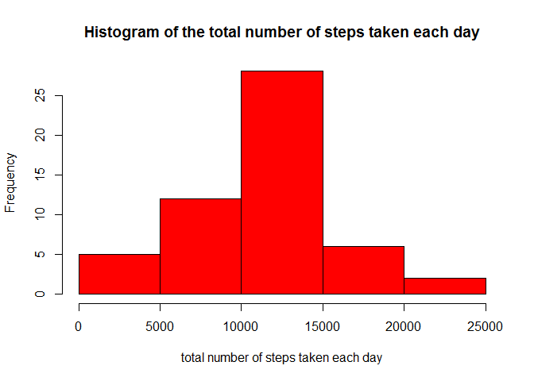
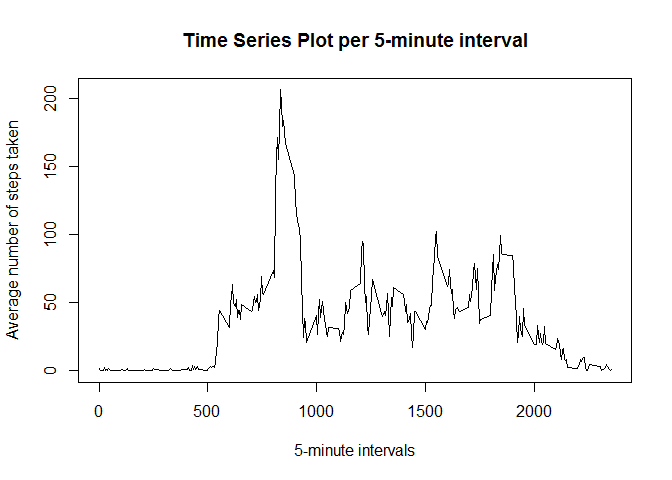
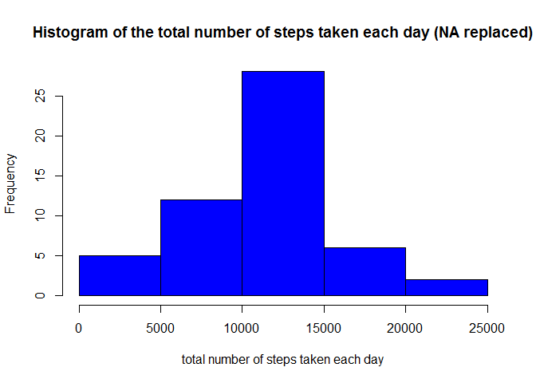
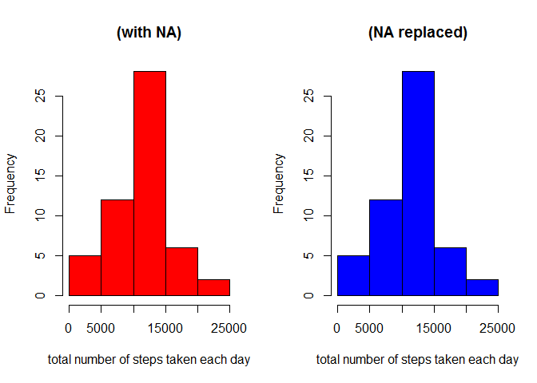
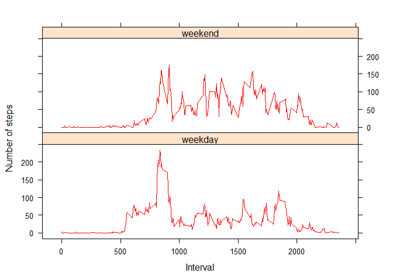

# Reproducible Research: Peer Assessment 1
opts_chunk$set(echo=TRUE, results='asis')

#Loading and preprocessing the data
# Read in the data.

```r
if(!file.exists('activity.csv')){
    unzip('activity.zip')
}
dataframe <- read.csv("activity.csv")
```
# Format date column in date type 

```r
dataframe$date <- as.Date(dataframe$date, format = "%Y-%m-%d")  
```
# Create dataframe with total steps per day

```r
dataframe.day <- aggregate(dataframe$steps, by = list(dataframe$date), sum)
names(dataframe.day)[1] <- "day"
names(dataframe.day)[2] <- "steps"
```
# Create dataframe with total steps per interval

```r
dataframe.interval <- aggregate(dataframe$steps, by = list(dataframe$interval), sum, na.rm = TRUE, 
    na.action = NULL)
names(dataframe.interval)[1] <- "interval"
names(dataframe.interval)[2] <- "steps"
```
# What is mean total number of steps taken per day?
# create dataframe with mean steps per interval
# 1.Make a histogram of the total number of steps taken each day

```r
dataframe.mean.interval <- aggregate(dataframe$steps, by = list(dataframe$interval), mean, na.rm = TRUE, 
    na.action = NULL)
names(dataframe.mean.interval)[1] <- "interval"
names(dataframe.mean.interval)[2] <- "mean.steps"

hist(dataframe.day$steps, main = "Histogram of the total number of steps taken each day", 
    xlab = "total number of steps taken each day",col="red")
```

 

#2.Calculate and report the mean and median total number of steps taken per day


```r
mean(dataframe.day$steps, na.rm = TRUE)
```

```
## [1] 10766
```

```r
median(dataframe.day$steps, na.rm = TRUE)
```

```
## [1] 10765
```
## What is the average daily activity pattern?
# 1.Make a time series plot (i.e. type = "l") of the 5-minute interval (x-axis) and the average number of steps taken, averaged across all days (y-axis)

```r
plot(dataframe.mean.interval$interval, dataframe.mean.interval$mean.steps, type = "n", main = "Time Series Plot per 5-minute interval", 
    xlab = "5-minute intervals", ylab = "Average number of steps taken")
lines(dataframe.mean.interval$interval, dataframe.mean.interval$mean.steps, type = "l")
```

 

# Which five minute interval has the highest mean number of steps?

```r
dataframe.mean.interval[which.max(dataframe.mean.interval$mean.steps), 1]
```

```
## [1] 835
```
## Imputing missing values

# Total number of missing values in the dataset:

```r
sum(is.na(dataframe$steps))
```

```
## [1] 2304
```
# 2.Devise a strategy for filling in all of the missing values in the dataset. Replacing missing values with mean.
# Merge dataframe and dataframe.mean.interval dataframes
# Resulting set is sorted by date and interval

```r
dataframe.missing <- merge(dataframe, dataframe.mean.interval, by = "interval", sort = FALSE)  
dataframe.missing <- dataframe.missing[with(dataframe.missing, order(date, interval)), ]  
```
# Number of steps now has fractions due to replaced missing values with mean

```r
  head(dataframe.missing)
```

```
##     interval steps       date mean.steps
## 1          0    NA 2012-10-01    1.71698
## 63         5    NA 2012-10-01    0.33962
## 128       10    NA 2012-10-01    0.13208
## 205       15    NA 2012-10-01    0.15094
## 264       20    NA 2012-10-01    0.07547
## 327       25    NA 2012-10-01    2.09434
```
# Rounding off the values to avoid fractions

```r
  dataframe.missing$steps <- round(dataframe.missing$steps, digits = 0)
```

## Creating new data set

```r
dataframe.new <- dataframe.missing[, c(2, 3, 1)]
```
## Histogram of total number of steps
# Make a histogram of the total number of steps taken each day and Calculate and report the mean and median total number of steps taken per day.
# Create dataframe with total steps per day different from before since this has NA replaced with mean steps per interval

```r
dataframe.day.new <- aggregate(dataframe.new$steps, by = list(dataframe.new$date), sum)
names(dataframe.day.new)[1] <- "day"
names(dataframe.day.new)[2] <- "steps"
```
# Histogram of the total number of steps taken each day

```r
hist(dataframe.day.new$steps, main = "Histogram of the total number of steps taken each day (NA replaced)", 
    xlab = "total number of steps taken each day",col="blue")
```

 
# Calculate and report the mean and median total number of steps taken per day. Do these values differ from the estimates from the first part of the assignment? What is the impact of imputing missing data on the estimates of the total daily number of steps?
# The mean and median total number of steps taken per day
# Mean number of steps per day:

```r
mean(dataframe.day.new$steps, na.rm = TRUE)
```

```
## [1] 10766
```
# Median number of steps per day:

```r
median(dataframe.day.new$steps, na.rm = TRUE)
```

```
## [1] 10765
```
# The values differ. The Mean is equal to the estimates from the first part of the assignment.
# Whereas, the Median is slightly lower when compared to the first part of the assignment. 

#The histogram has similar shape except the frequencies have gone up as missing values are replaced. Below is side by side illustration.

```r
par(mfrow = c(1, 2))

hist(dataframe.day$steps, main = "(with NA)", xlab = "total number of steps taken each day",col="red")

hist(dataframe.day.new$steps, main = "(NA replaced)", xlab = "total number of steps taken each day",col="blue")
```

 
#Estimates of the total daily number of steps
#Are there differences in activity patterns between weekdays and weekends?
#Create a new factor variable in the dataset with two levels - "weekday" and "weekend" 
# First create copy of the dataframe

```r
dataframe.new.2 <- dataframe.new
```
# create a factor with the names of the days for all dates

```r
dataframe.new.2$weekdays <- factor(format(dataframe.new.2$date, "%A"))
levels(dataframe.new.2$weekdays)
```

```
## [1] "Friday"    "Monday"    "Saturday"  "Sunday"    "Thursday"  "Tuesday"  
## [7] "Wednesday"
```

```r
levels(dataframe.new.2$weekdays) <- list(weekday = c("Monday", "Tuesday", "Wednesday", 
    "Thursday", "Friday"), weekend = c("Saturday", "Sunday"))
```
#Make a panel plot containing a time series plot (i.e. type = "l") of the 5-minute interval vs. the average number of steps taken, averaged across all weekday days or weekend days.

```r
dataframe.new.2.mean.interval <- aggregate(dataframe.new.2$steps, by = list(dataframe.new.2$weekdays, 
    dataframe.new.2$interval), mean, na.rm = TRUE, na.action = NULL)
names(dataframe.new.2.mean.interval)[1] <- "weekday"
names(dataframe.new.2.mean.interval)[2] <- "interval"
names(dataframe.new.2.mean.interval)[3] <- "mean.steps"

library(lattice)
xyplot(dataframe.new.2.mean.interval$mean.steps ~ dataframe.new.2.mean.interval$interval | 
    dataframe.new.2.mean.interval$weekday, layout = c(1, 2), type = "l", xlab = "Interval", 
    ylab = "Number of steps",col=c("red"))
```

 
